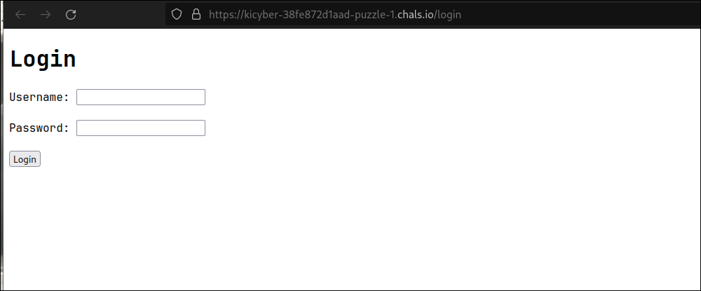
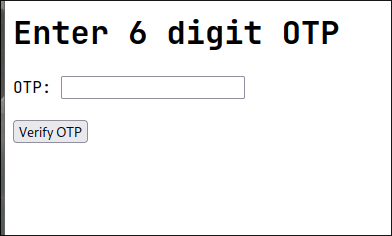
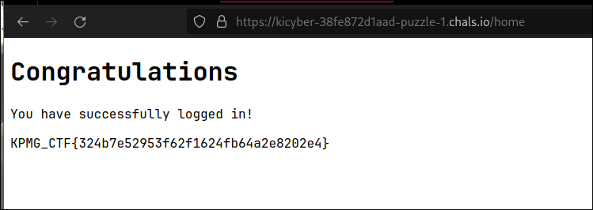

# OTP Portal Intrigue
> Your mission, should you choose to accept it,  is to infiltrate a mysterious portal secured by OTP authentication. 
159.65.146.255 

This challenge gives us a login page requiring username and passsword. This challenge also gives us an IP address. On running a `nmap` scan on this IP we can see that there is an ftp server running.
```sh
[ssk@arch kic]$ nmap -F 159.65.146.255
starting Nmap 7.94 ( https://nmap.org ) at 2023-87-38 16:39 IST
Nmap scan report for 159.65.146.255
Host is up (0.22s latency).
Not shown: 97 filtered tcp ports (no-response)
PORT    STATE   SERVICE
21/tcp  open    ftp
80/tcp  closed  http
443/tcp closed  https

Nmap done: 1 IP address (1 host up) scanned in 9.17 seconds
```

We can then anonymously login into this server using `anonymous` as username and password. The server has a `my_database.sql` file.

```sh
[ssk@arch kic]$ ftp 159.65.146.255
Connected to 159.65.146.255.
220 (vsFTPd 3.0.5)
Name (159.65.146.255:ssk): anonymous
331 Please specify the password.
Password:
230 Login successful.
Remote system type is UNIX.
Using binary mode to transfer files.
ftp> ls
200 PORT command successful. Consider using PASV.
150 Here comes the directory listing.
-rPW-P--P-- 1   0     0     1891 Mar 24 06:54 my_database.sql
226 Directory send OK.
ftp> get my_database.sql
200 PORT command successful. Consider using PASV.
150 Opening BINARY mode data connection for my_database.sql (1891 bytes).
226 Transfer complete.
1891 bytes received in 0.000115 seconds (15.7 Mbytes/s)
ftp> quit
221 Goodbye.
```
This file contains the code used to create the database for the login page.
`my_database.sql`:
```sql
-- MariaDB dump 10.19  Distrib 10.4.27-MariaDB, for Linux (x86_64)
--
-- Host: localhost    Database: CTF2
-- ------------------------------------------------------
-- Server version	10.4.27-MariaDB

/*!40101 SET @OLD_CHARACTER_SET_CLIENT=@@CHARACTER_SET_CLIENT */;
/*!40101 SET @OLD_CHARACTER_SET_RESULTS=@@CHARACTER_SET_RESULTS */;
/*!40101 SET @OLD_COLLATION_CONNECTION=@@COLLATION_CONNECTION */;
/*!40101 SET NAMES utf8mb4 */;
/*!40103 SET @OLD_TIME_ZONE=@@TIME_ZONE */;
/*!40103 SET TIME_ZONE='+00:00' */;
/*!40014 SET @OLD_UNIQUE_CHECKS=@@UNIQUE_CHECKS, UNIQUE_CHECKS=0 */;
/*!40014 SET @OLD_FOREIGN_KEY_CHECKS=@@FOREIGN_KEY_CHECKS, FOREIGN_KEY_CHECKS=0 */;
/*!40101 SET @OLD_SQL_MODE=@@SQL_MODE, SQL_MODE='NO_AUTO_VALUE_ON_ZERO' */;
/*!40111 SET @OLD_SQL_NOTES=@@SQL_NOTES, SQL_NOTES=0 */;

--
-- Table structure for table `users`
--

DROP TABLE IF EXISTS `users`;
/*!40101 SET @saved_cs_client     = @@character_set_client */;
/*!40101 SET character_set_client = utf8 */;
CREATE TABLE `users` (
  `number` varchar(100) NOT NULL, `username` varchar(100) NOT NULL, `password` varchar(100) NOT NULL, `TOTP` varchar(100) NOT NULL
) ENGINE=InnoDB DEFAULT CHARSET=utf8mb4 COLLATE=utf8mb4_general_ci;
/*!40101 SET character_set_client = @saved_cs_client */;

--
-- Dumping data for table `users`
--

INSERT INTO `users` VALUES ('1', 'admin', 'admin', 'YDTN2JY6CWKSK6PB3HNOAY4APASUVREM');
UNLOCK TABLES;

UNLOCK TABLES;
/*!40103 SET TIME_ZONE=@OLD_TIME_ZONE */;

/*!40101 SET SQL_MODE=@OLD_SQL_MODE */;
/*!40014 SET FOREIGN_KEY_CHECKS=@OLD_FOREIGN_KEY_CHECKS */;
/*!40014 SET UNIQUE_CHECKS=@OLD_UNIQUE_CHECKS */;
/*!40101 SET CHARACTER_SET_CLIENT=@OLD_CHARACTER_SET_CLIENT */;
/*!40101 SET CHARACTER_SET_RESULTS=@OLD_CHARACTER_SET_RESULTS */;
/*!40101 SET COLLATION_CONNECTION=@OLD_COLLATION_CONNECTION */;
/*!40111 SET SQL_NOTES=@OLD_SQL_NOTES */;

-- Dump completed on 2023-03-24 11:51:06
```

We can see that there is a user with `admin` as username and password. It also has TOTP field with value `YDTN2JY6CWKSK6PB3HNOAY4APASUVREM`. This is the seed for Time based OTP generator. When we use the credentials to login, it asks us for a 6 digit OTP. I used an [online TOTP generator](https://totp.danhersam.com/) to generate the OTP.



